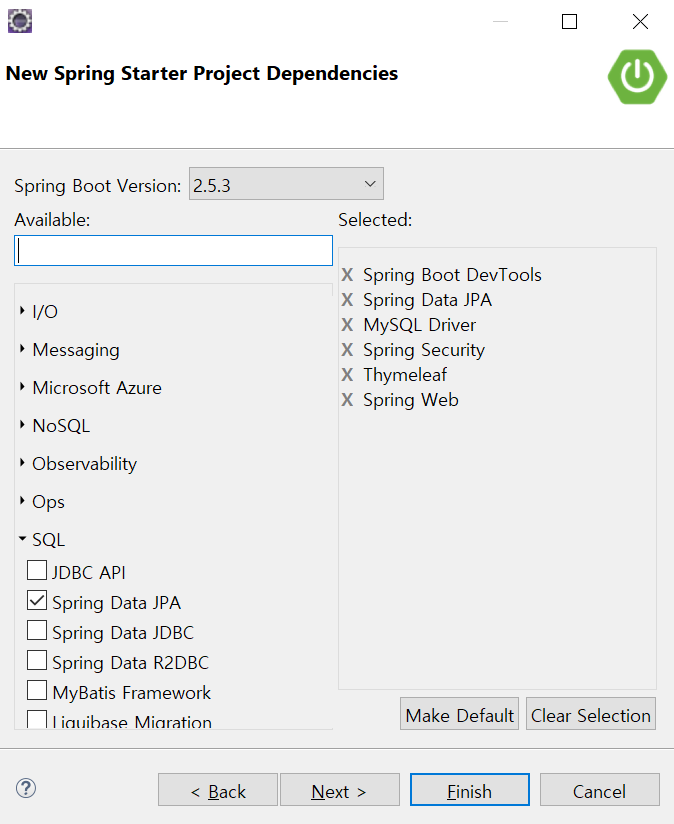
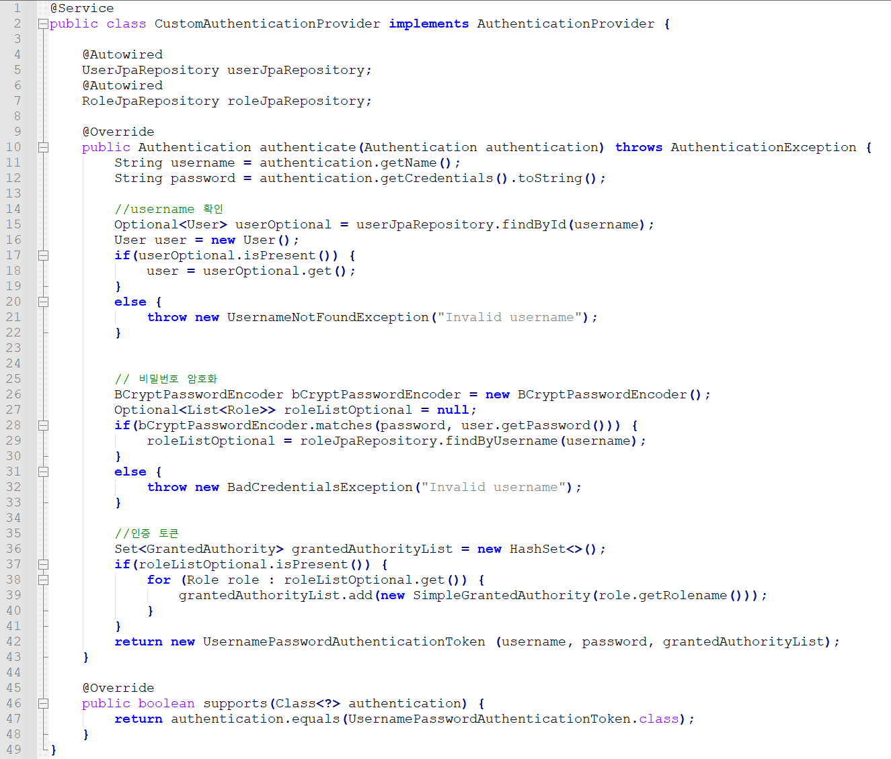
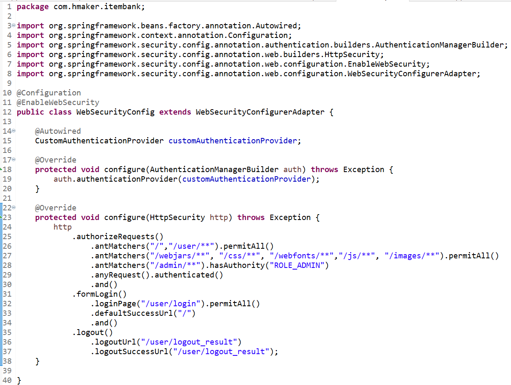
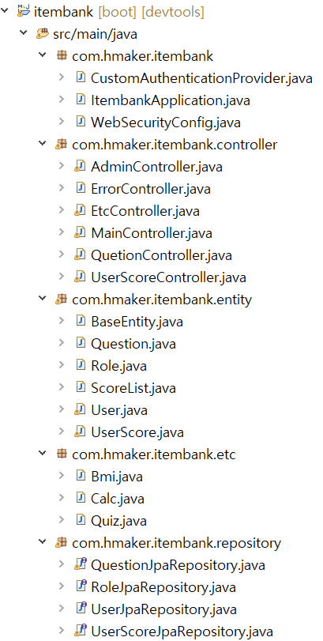
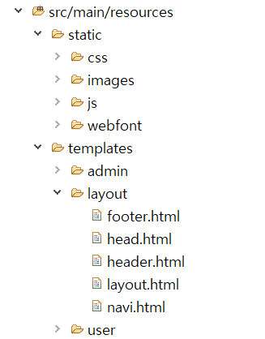
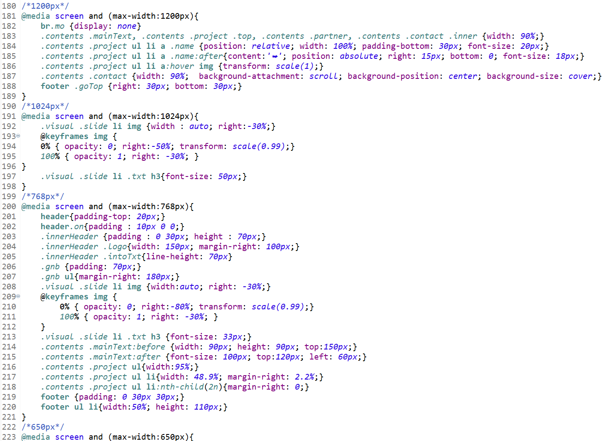

# 간단 소개

- **Made by SungYun Hwang** 
- **문제은행 웹사이트 만들기(with Java Spring Data JPA)**
- **언어 및 작업툴**: JAVA(Version 15.0.2),HTML,CSS,JAVASCRIPT // Eclipse(Version 4.17.0), Mysql Workbench 8.0, Visual Studio Code(Version 1.57.1)
- **프레임** : SPRING DATA JPA

# 프로젝트 상세내용

## :point_right: 주제

- **문제와 간단한 게임을 푸는 반응형 웹페이지 구현**

## :point_right: 목적

- **MVC 설계와 데이터베이스 간의 통신을 이해하고, 스프링 시큐리티를 적용해 권한별 웹페이지를 구현하고, 홈페이지 첫화면은 반응형으로 설계하며, 기본적인 게임과 문제를 푸는 웹페이지 구현**

## :point_right: 구현 목표
<pre>
1. 문제은행을 통해 문제 풀고 점수 확인할 수 있는 웹페이지 구현 
 - 첫 화면은 반응형으로 구성 
2. Mysql과 연동하여 데이터를 주고 받을 수 있게 구현 
 - 유저에 따른 ROLE설정 및 점수 관리 
3. 권한에 따른 웹페이지 접근 권한 설정 
 - ADMIN 계정으로만 유저에 대한 정보 수정 및 삭제 할 수 있게 설정 
</pre>

## :point_right: 설계 및 구동화면
---
### **초기 Dependencies 설정** 
---
 
___
### **비밀번호 암호화 및 토큰 생성** 
---
 
___
### **시큐리티 적용해 관리자 파일 구분 및 로그인 로그아웃 관리** 
---
 
___
### **Control, Entity, Repository, Class List** 
---
   
___
### **Template 구성 요소** 
---
 
___
### **CSS파일내에 반응형으로 구현하기 위한 소스코드** 
---
 
___
### **홈페이지 첫 화면(반응형)** 
---
 

